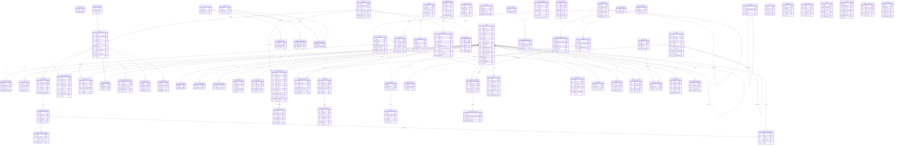

# Database Diagram — horoacademy-backoffice

```mermaid
erDiagram

%% ─── USER MANAGEMENT ───
users {
    uuid id PK
    uuid parent_id FK
    string line_profile_id
    string phone
    string name
    string email
    date date_of_birth
    time time_of_birth
    string gender
    string horoscope_element
    jsonb horo_information
    uuid birthdate_book_id FK
    string referral_code
    boolean is_paid
    boolean blacklist
    string register_type
    decimal spend
}
admins {
    uuid id PK
    string name
    string email
    string admin_nickname
    string bank_brand
    string bank_number
    string id_card_number
}
type_of_users {
    uuid id PK
    string name
}
admin_social_profiles {
    uuid id PK
    uuid admin_id FK
    string provider
    string provider_id
}
otps {
    uuid id PK
    uuid user_id FK
    string email
    string code
}

users ||--o{ users : "parent-child"
users ||--o{ otps : "has"
admins ||--o{ admin_social_profiles : "has"

%% ─── PERMISSIONS (Spatie) ───
roles {
    uuid id PK
    string name
    string guard_name
}
permissions {
    uuid id PK
    string name
    string guard_name
}
model_has_roles {
    uuid role_id FK
    string model_type
    uuid model_id
}
model_has_permissions {
    uuid permission_id FK
    string model_type
    uuid model_id
}
role_has_permissions {
    uuid role_id FK
    uuid permission_id FK
}

roles ||--o{ model_has_roles : "assigned via"
permissions ||--o{ model_has_permissions : "assigned via"
roles ||--o{ role_has_permissions : ""
permissions ||--o{ role_has_permissions : ""

%% ─── COURSE SYSTEM ───
course_categories {
    uuid id PK
    string name
    int order
}
courses {
    uuid id PK
    uuid course_category_id FK
    uuid bank_id FK
    string name
    text description
    decimal price
    decimal full_price
    int study_minute
    boolean is_active
    boolean is_recommend
    jsonb tags
}
course_lessons {
    uuid id PK
    uuid course_id FK
    string name
    int order
    string video_url
    boolean is_skippable
}
course_lesson_questions {
    uuid id PK
    uuid course_id FK
    uuid lesson_id FK
    text question
    string question_type
}
course_lesson_question_choices {
    uuid id PK
    uuid question_id FK
    int choice_number
    text choice_text
}
course_lesson_question_answers {
    uuid id PK
    uuid user_id FK
    uuid question_id FK
    text answer
    decimal score
}
course_exam_results {
    uuid id PK
    uuid user_id FK
    uuid course_id FK
    uuid lesson_id FK
    int total_exam
    int score
    boolean is_passed
    enum approved_status
    enum type
}
course_accesses {
    uuid id PK
    uuid user_id FK
    uuid course_id FK
    boolean is_subscription
    enum status
    int day
}
course_certificates {
    uuid id PK
    uuid user_id FK
    uuid course_id FK
}
course_price_promotions {
    uuid id PK
    uuid course_id FK
    decimal promotion_price
    datetime started_at
    datetime ended_at
}
course_faqs {
    uuid id PK
    uuid course_id FK
    text question
    text answer
}
course_documents {
    uuid id PK
    uuid course_id FK
    string name
    string file_url
}

course_categories ||--o{ courses : "has"
courses ||--o{ course_lessons : "has"
course_lessons ||--o{ course_lesson_questions : "has"
course_lesson_questions ||--o{ course_lesson_question_choices : "has"
course_lesson_questions ||--o{ course_lesson_question_answers : "answered by"
courses ||--o{ course_exam_results : "has"
courses ||--o{ course_accesses : "granted via"
courses ||--o{ course_certificates : "issues"
courses ||--o{ course_price_promotions : "has"
courses ||--o{ course_faqs : "has"
courses ||--o{ course_documents : "has"
users ||--o{ course_accesses : "has"
users ||--o{ course_exam_results : "takes"
users ||--o{ course_lesson_question_answers : "submits"
users ||--o{ course_certificates : "earns"

%% ─── HOROSCOPE / FENG SHUI ───
horo_details {
    uuid id PK
    uuid parent_id FK
    string name
    string name_en
    string code
    enum element
}
flying_stars {
    uuid id PK
    string code
    jsonb recommend
    jsonb modern
    jsonb chinese
}
nine_generation_stars {
    uuid id PK
    float start
    float end
    int stars_8
    int stars_24
    enum direction
    enum front
}
touch_stars {
    uuid id PK
    uuid zodiac_id FK
    uuid star_id FK
    string name
    boolean is_active
    jsonb tags
}
horo_advice {
    uuid id PK
    uuid star_id FK
    uuid zodiac_id FK
    text advice_title
    text advice_message
}
sixty_four_kuay {
    uuid id PK
    string name
    string gazhi
    string code
    text description
}
solar_terms {
    uuid id PK
    string name
    string date_range
    string solar_term_type
}
user_horo_settings {
    uuid id PK
    uuid user_id FK
}
user_horo_today_details {
    uuid id PK
    uuid user_id FK
}
user_horo_advice_actives {
    uuid id PK
    uuid user_id FK
}
user_birthdate_books {
    uuid id PK
    uuid user_id FK
    string name
    int book_year
    string mode
}
lucky_numbers {
    uuid id PK
    uuid user_id FK
    jsonb numbers
    datetime started_at
    datetime expired_at
}

horo_details ||--o{ horo_details : "parent-child"
horo_details ||--o{ touch_stars : "zodiac ref"
flying_stars ||--o{ touch_stars : "star ref"
flying_stars ||--o{ horo_advice : "star ref"
users ||--o{ user_horo_settings : "has"
users ||--o{ user_horo_today_details : "has"
users ||--o{ user_horo_advice_actives : "has"
users ||--o{ user_birthdate_books : "has"
users ||--o{ lucky_numbers : "has"

%% ─── PAYMENT SYSTEM ───
banks {
    uuid id PK
    string omise_recp_id
    string name
    enum bank_brand
    string bank_number
    boolean is_active
    boolean is_default
}
payment_transactions {
    uuid id PK
    uuid user_id FK
    uuid bank_id FK
    uuid created_by FK
    string model_type
    uuid model_id
    string method
    decimal amount
    enum status
    boolean is_subscription
    string omise_customer_id
    datetime next_billing_date
    string wpe_task_id
}
payment_links {
    uuid id PK
    uuid user_id FK
    uuid bank_id FK
    string name
    decimal price
    enum payment_type
    jsonb allowed_payment_methods
    enum status
    int max_usage_count
    datetime expires_at
}
package_payments {
    uuid id PK
    uuid bank_id FK
    string name
    decimal price
    int day
    int quantity
}
coupons {
    uuid id PK
    uuid parent_id FK
    uuid created_by FK
    string name
    string code
    enum coupon_type
    enum discount_type
    decimal discount_amount
    boolean is_active
    jsonb give_permission
}
coupon_transactions {
    uuid id PK
    uuid coupon_id FK
    uuid user_id FK
    decimal discount_amount
    decimal commission_amount
    enum status
}
refund_transactions {
    uuid id PK
    uuid payment_id FK
    uuid user_id FK
    decimal amount
    string reason
    enum status
}

banks ||--o{ payment_transactions : "receives"
banks ||--o{ payment_links : "linked to"
banks ||--o{ package_payments : "linked to"
banks ||--o{ courses : "linked to"
users ||--o{ payment_transactions : "makes"
payment_transactions ||--o{ refund_transactions : "refunded via"
coupons ||--o{ coupons : "parent-child"
coupons ||--o{ coupon_transactions : "used via"
users ||--o{ coupon_transactions : "uses"

%% ─── PRODUCTS / ORDERS ───
feng_shui_products {
    uuid id PK
    uuid bank_id FK
    string name
    decimal price
    int stock
    string sku
    boolean buy_with_points
}
zodiac_products {
    uuid id PK
    uuid bank_id FK
    string name
    decimal price
    enum zodiac
    enum element
    int stock
}
element_products {
    uuid id PK
    enum element
}
element_product_items {
    uuid id PK
    uuid element_id FK
    string product_name
    decimal price
}
flying_star_products {
    uuid id PK
    tinyint star
}
flying_star_product_items {
    uuid id PK
    uuid flying_star_product_id FK
    tinyint star
    tinyint target_star
    enum relation
    enum type
}
order_products {
    uuid id PK
    uuid user_id FK
    string order_number
    decimal total_amount
    enum status
    jsonb meta
}
order_product_items {
    uuid id PK
    uuid order_id FK
    string product_type
    uuid product_id
    int quantity
    decimal price
    jsonb address
}

element_products ||--o{ element_product_items : "has"
flying_star_products ||--o{ flying_star_product_items : "has"
users ||--o{ order_products : "places"
order_products ||--o{ order_product_items : "contains"

%% ─── POINTS & REWARDS ───
point_profiles {
    uuid id PK
    uuid user_id FK
    int current_points
}
point_transactions {
    uuid id PK
    uuid point_profile_id FK
    int amount
    string type
    string description
}
reward_categories {
    uuid id PK
    string name
    text description
}
rewards {
    uuid id PK
    uuid reward_category_id FK
    string name
    int points_required
    int stock
}
reward_vouchers {
    uuid id PK
    uuid reward_id FK
    string code
}
reward_redeem_transactions {
    uuid id PK
    uuid user_id FK
    uuid reward_id FK
    enum status
    datetime redeemed_at
}
reward_delivery_orders {
    uuid id PK
    uuid reward_redeem_transaction_id FK
    string tracking_number
    string delivery_status
}

users ||--|| point_profiles : "has"
point_profiles ||--o{ point_transactions : "records"
reward_categories ||--o{ rewards : "has"
rewards ||--o{ reward_vouchers : "has"
rewards ||--o{ reward_redeem_transactions : "redeemed via"
users ||--o{ reward_redeem_transactions : "redeems"
reward_redeem_transactions ||--o{ reward_delivery_orders : "shipped via"

%% ─── CONTENT / CMS ───
blogs {
    uuid id PK
    uuid author_id FK
    string name
    text short_desc
    text description
    boolean is_active
    jsonb tags
    datetime published_at
}
blog_categories {
    uuid id PK
    uuid running_category_id FK
    string name
    int order
}
faqs {
    uuid id PK
    int order
    text question
    text answer
}
hero_banners {
    uuid id PK
    string name
    text description
    int order
    string link_url
}
feature_stories {
    uuid id PK
    string title
    text description
    int order
    boolean is_active
}
seos {
    uuid id PK
    string related_type
    uuid related_id
    string title
    text description
    text keywords
}
media {
    bigint id PK
    string model_type
    uuid model_id
    string collection_name
    string file_name
    string mime_type
    bigint size
}

admins ||--o{ blogs : "authors"
blog_categories ||--o{ blog_categories : "parent-child"

%% ─── APP ACCESS & REFERRAL ───
app_accesses {
    uuid id PK
    uuid user_id FK
    uuid permission_id FK
    uuid created_by FK
    enum status
    boolean is_subscription
    int day
}
user_referrals {
    uuid id PK
    uuid user_id FK
    string referral_code
}
user_transfers {
    uuid id PK
    uuid user_id FK
    decimal amount
    enum status
}
account_merge_logs {
    uuid id PK
    uuid from_user_id FK
    uuid to_user_id FK
    string reason
    datetime merged_at
}
impersonate_links {
    uuid id PK
    uuid admin_id FK
    uuid user_id FK
    string link_token
    datetime expires_at
}

users ||--o{ app_accesses : "has"
users ||--o{ user_referrals : "has"
users ||--o{ user_transfers : "has"
admins ||--o{ impersonate_links : "creates"
users ||--o{ impersonate_links : "target"

%% ─── LOTTERY & NOTIFICATIONS ───
lottery_results {
    uuid id PK
    string code
    string name
    date draw_date
}
user_lottery_results {
    uuid id PK
    uuid user_id FK
    uuid lottery_result_id FK
}
user_notifications {
    uuid id PK
    uuid user_id FK
    string title
    string message
    string type
    datetime read_at
}
line_notification_settings {
    uuid id PK
    uuid user_id FK
    boolean enabled
    string status
}

lottery_results ||--o{ user_lottery_results : "linked to"
users ||--o{ user_lottery_results : "has"
users ||--o{ user_notifications : "receives"
users ||--o{ line_notification_settings : "configures"

%% ─── SYSTEM / AUDIT ───
activity_logs {
    bigint id PK
    string event
    string model_type
    uuid model_id
    jsonb properties
    uuid batch_uuid
}
```
