# Database Diagram — horoacademy-wpe-service

```mermaid
erDiagram

%% ─── CORE TASK DOMAIN ───
task_types {
    uuid id PK
    string key
    string name
    boolean is_active
}

tasks {
    uuid id PK
    uuid user_id
    uuid sale_admin_id
    uuid agent_admin_id
    uuid ceremony_master_id
    uuid task_type FK
    string name
    jsonb content
    enum status
    datetime ceremony_date
    datetime deadline_at
    datetime completed_at
    jsonb meta
    uuid created_by
    uuid updated_by
    uuid deleted_by
    datetime deleted_at
}

task_subs {
    uuid id PK
    uuid task_id FK
    int order
    string name
    string step_key
    jsonb content
    enum status
    string note
    uuid assigned_by
}

task_payments {
    uuid id PK
    uuid task_id FK
    enum type
    enum method
    uuid bank_id
    double paid_amount
    datetime paid_at
    double received_amount
    datetime received_at
    string note
    jsonb meta
}

task_refunds {
    uuid id PK
    uuid task_id FK
    string refundable_type
    uuid refundable_id
    string provider_id
    string transaction_id
    string method
    double amount
    string reason
    enum status
    datetime refunded_at
    string created_by
}

task_calendars {
    uuid id PK
    uuid task_id FK
    string name
    jsonb address
    datetime start_date
    datetime end_date
    enum status
    string google_event_id
    jsonb meta
}

task_notifications {
    uuid id PK
    uuid task_id FK
    string type
    string title
    jsonb content
    datetime target_date
    datetime raw_date
    enum status
    jsonb meta
}

task_comments {
    uuid id PK
    uuid task_id FK
    uuid task_sub_id FK
    text comment
    uuid created_by
    uuid updated_by
    uuid deleted_by
    datetime deleted_at
}

task_types ||--o{ tasks : "typed as"
tasks ||--o{ task_subs : "has"
tasks ||--o{ task_payments : "paid via"
tasks ||--o{ task_refunds : "refunded via"
tasks ||--o{ task_calendars : "scheduled in"
tasks ||--o{ task_notifications : "notifies"
tasks ||--o{ task_comments : "commented on"
task_subs ||--o{ task_comments : "commented on"

%% ─── EXPENSE SYSTEM ───
expenses {
    uuid id PK
    string type
    double amount
    string description
    jsonb input
    jsonb payment
    jsonb meta
}

expense_sub_tasks {
    uuid id PK
    uuid expense_id FK
    uuid sub_task_id FK
}

expenses ||--o{ expense_sub_tasks : "linked via"
task_subs ||--o{ expense_sub_tasks : "linked via"

%% ─── GRAVE SYSTEM (Saki) ───
graves {
    uuid id PK
    string badge
    int number
    int no
    text note
    enum status
    datetime deleted_at
}

task_has_graves {
    uuid id PK
    uuid task_id FK
    uuid grave_id FK
}

grave_status_logs {
    uuid id PK
    uuid grave_id FK
    string old_status
    string new_status
    uuid changed_by_id
    string source
    jsonb source_detail
    text note
}

graves ||--o{ task_has_graves : "reserved via"
tasks ||--o{ task_has_graves : "reserves"
graves ||--o{ grave_status_logs : "logs"

%% ─── LERK SLOT ───
lerk_used_slots {
    uuid id PK
    uuid task_id FK
    uuid task_sub_id
    datetime ceremony_date
    string slot_display_name
    text filter_config
}

tasks ||--|| lerk_used_slots : "occupies"

%% ─── EXPENSE REPORTING ───
sinsae_commissions {
    uuid id PK
    string batch_no
    text remark
    string status
    jsonb meta
}

sinsae_commission_lists {
    uuid id PK
    uuid sinsae_commission_id FK
    uuid task_id FK
    uuid ceremony_master_id
    double expense_amount
    double sinsae_ceremony_price
    double advance_payment_amount
    double total_amount
}

sinsae_commissions ||--o{ sinsae_commission_lists : "contains"
tasks ||--o{ sinsae_commission_lists : "referenced in"

%% ─── DOCUMENT SYSTEM ───
document_references {
    uuid id PK
    string type
    string document_no
    date document_date
    string status
    text remark
    jsonb meta
    uuid created_by
    uuid updated_by
}

document_reference_lists {
    uuid id PK
    uuid document_reference_id FK
    string reference_type
    uuid reference_id
    string type
    int amount
}

document_references ||--o{ document_reference_lists : "contains"

%% ─── PRODUCTS & EVENTS ───
products {
    uuid id PK
    string name
    text description
    decimal cost_price
    decimal selling_price
}

events {
    uuid id PK
    string name
    text description
    datetime start_date
    datetime end_date
    string location
    double cost_price
    double selling_price
}

%% ─── THAI ADDRESS ───
provinces {
    uuid id PK
    string name
}

districts {
    uuid id PK
    uuid province_id FK
    string name
}

sub_districts {
    uuid id PK
    uuid district_id FK
    string name
}

postal_codes {
    uuid id PK
    uuid sub_district_id FK
    uuid district_id FK
    uuid province_id FK
    int code
}

user_addresses {
    uuid id PK
    uuid user_id
    string building_no
    string address
    string sub_district
    string district
    string province
    string postal_code
    string phone
    text foreign_address
    boolean is_default
}

countries {
    uuid id PK
    string name_th
    string name_en
}

provinces ||--o{ districts : "has"
districts ||--o{ sub_districts : "has"
sub_districts ||--o{ postal_codes : "has"
districts ||--o{ postal_codes : "ref"
provinces ||--o{ postal_codes : "ref"

%% ─── AUTH / PERMISSIONS (Spatie) ───
roles {
    uuid id PK
    string name
    string guard_name
}

permissions {
    uuid id PK
    string name
    string guard_name
}

model_has_roles {
    uuid role_id FK
    string model_type
    uuid model_id
}

model_has_permissions {
    uuid permission_id FK
    string model_type
    uuid model_id
}

role_has_permissions {
    uuid permission_id FK
    uuid role_id FK
}

resource_accesses {
    uuid id PK
    string resource_type
    uuid resource_id
    uuid admin_id
}

roles ||--o{ model_has_roles : "assigned via"
permissions ||--o{ model_has_permissions : "assigned via"
roles ||--o{ role_has_permissions : ""
permissions ||--o{ role_has_permissions : ""

%% ─── OAUTH (Laravel Passport) ───
oauth_clients {
    uuid id PK
    uuid user_id
    string name
    string secret
    string provider
    text redirect
    boolean personal_access_client
    boolean password_client
    boolean revoked
}

oauth_access_tokens {
    string id PK
    uuid user_id
    uuid client_id
    string name
    text scopes
    boolean revoked
    datetime expires_at
}

oauth_refresh_tokens {
    string id PK
    string access_token_id FK
    boolean revoked
    datetime expires_at
}

oauth_auth_codes {
    string id PK
    uuid user_id
    uuid client_id
    text scopes
    boolean revoked
    datetime expires_at
}

oauth_personal_access_clients {
    bigint id PK
    uuid client_id
}

oauth_access_tokens ||--o{ oauth_refresh_tokens : "refreshed via"

%% ─── ADMIN SOCIAL ───
admin_social_profiles {
    uuid id PK
    uuid admin_id
    string provider
    string provider_id
    string provider_token
    datetime bot_followed_at
    jsonb meta
}

%% ─── MESSAGING / NOTIFICATIONS ───
notifications {
    uuid id PK
    string type
    string notifiable_type
    uuid notifiable_id
    jsonb data
    datetime read_at
}

message_logs {
    bigint id PK
    string loggable_type
    uuid loggable_id
    string provider
    string target_id
    text message
    uuid sent_by
    string status
    datetime sent_at
}

%% ─── SYSTEM / INFRA ───
activity_log {
    uuid id PK
    string log_name
    text description
    string subject_type
    uuid subject_id
    string causer_type
    uuid causer_id
    string event
    json properties
    uuid batch_uuid
}

settings {
    bigint id PK
    string group
    string name
    boolean locked
    json payload
}

jobs {
    bigint id PK
    string queue
    longtext payload
    tinyint attempts
    int reserved_at
    int available_at
}

failed_jobs {
    bigint id PK
    string uuid
    text connection
    text queue
    longtext payload
    longtext exception
    timestamp failed_at
}

sessions {
    string id PK
    uuid user_id
    string ip_address
    text user_agent
    longtext payload
    int last_activity
}

telescope_entries {
    bigint sequence PK
    uuid uuid
    uuid batch_id
    string family_hash
    boolean should_display_on_index
    string type
    longtext content
    datetime created_at
}

telescope_entries_tags {
    uuid entry_uuid FK
    string tag
}

telescope_entries ||--o{ telescope_entries_tags : "tagged"
```



---

## Enum Reference

| Table | Column | Values |
|---|---|---|
| tasks | status | `pending` · `progress` · `success` · `reject` · `cancel` · `on-hold` · `delete` · `pending_payment` · `payment_failed` |
| task_subs | status | `pending` · `progress` · `success` · `cancel` |
| task_payments | type | `deposit` · `full` · `refund` |
| task_payments | method | `bank` · `credit` · `cash` · `free` · `other` · `payment_link` |
| task_calendars | status | `confirmed` · `tentative` · `cancelled` |
| task_notifications | status | `pending` · `success` · `cancel` |
| task_refunds | status | `pending` · `successful` · `failed` |
| graves | status | `in-active` · `reserve` · `in-progress` · `embed` · `disable` |

---

## Cross-DB References (wpe → horoacademy)

| Column | References |
|---|---|
| `tasks.user_id` | `horoacademy.users.id` |
| `tasks.sale_admin_id` | `horoacademy.admins.id` |
| `tasks.agent_admin_id` | `horoacademy.admins.id` |
| `tasks.ceremony_master_id` | `horoacademy.admins.id` |
| `task_payments.bank_id` | `horoacademy.banks.id` |
| `admin_social_profiles.admin_id` | `horoacademy.admins.id` |
| `sessions.user_id` | `horoacademy.users.id` |
| `resource_accesses.admin_id` | `horoacademy.admins.id` |

---

## Domain Architecture

```
tasks (core)
 ├── task_types         — ประเภทงาน (saki, fengshui, consult ...)
 ├── task_subs          — ขั้นตอนย่อย (unlock chain)
 │    └── expense_sub_tasks → expenses   — ค่าใช้จ่ายรายขั้นตอน
 ├── task_payments      — การชำระเงิน (deposit / full / refund)
 ├── task_refunds       — การคืนเงิน
 ├── task_calendars     — Google Calendar sync
 ├── task_notifications — การแจ้งเตือน scheduled
 ├── task_comments      — ความคิดเห็น
 ├── task_has_graves    — จองสุสาน (saki เท่านั้น)
 └── lerk_used_slots    — จองสล็อตพิธี (saki เท่านั้น)

graves
 └── grave_status_logs  — ประวัติการเปลี่ยนสถานะ

sinsae_commissions
 └── sinsae_commission_lists → tasks

document_references
 └── document_reference_lists (polymorphic)
```
